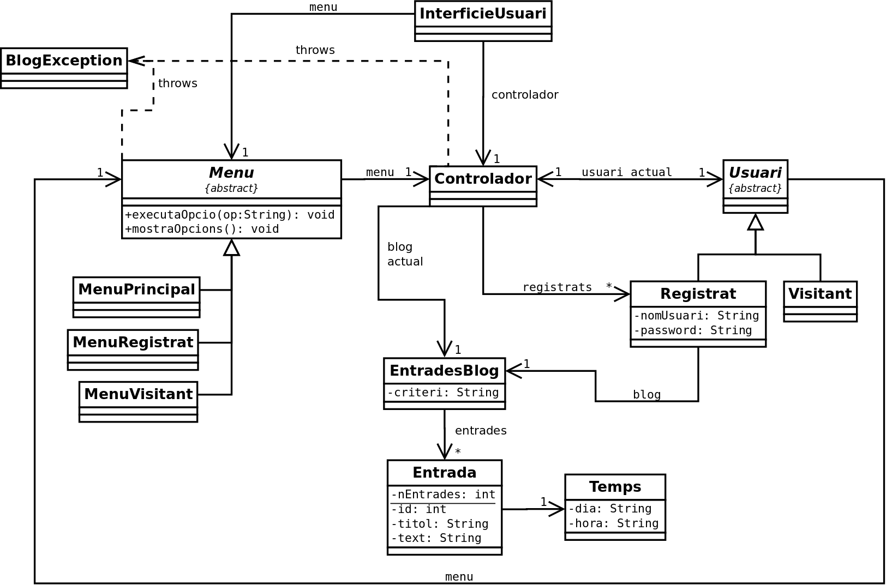

# Project Description
Aquesta aplicació permet gestionar un blog d'entrades de text personal. Ofereix diferents opcions depenent del tipus d'usuari: visitant o registrat.
Un usuari pot registrar-se a la aplicació i després iniciar sessió per veure, eliminar, afegir, etc. les teves notes.
Si no està registrat, pot accedir a la llista d'usuaris registrats des del menú de visitant. Tota la info està al javadoc.

Aquest projecte s'ha realitzat amb una finalitat educativa. 

# UML

